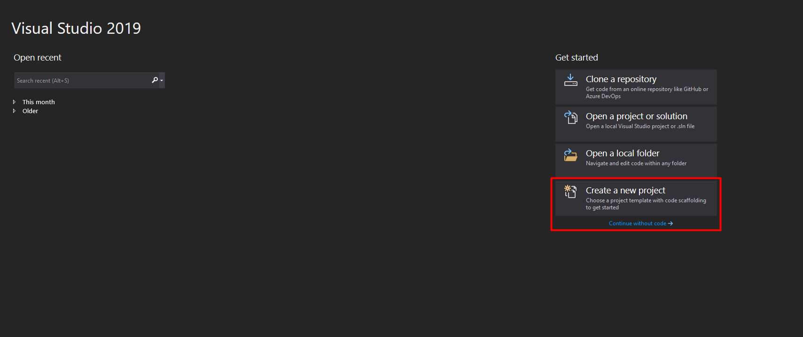
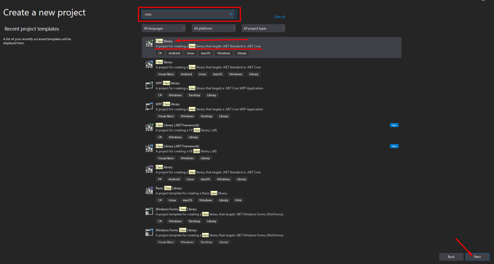
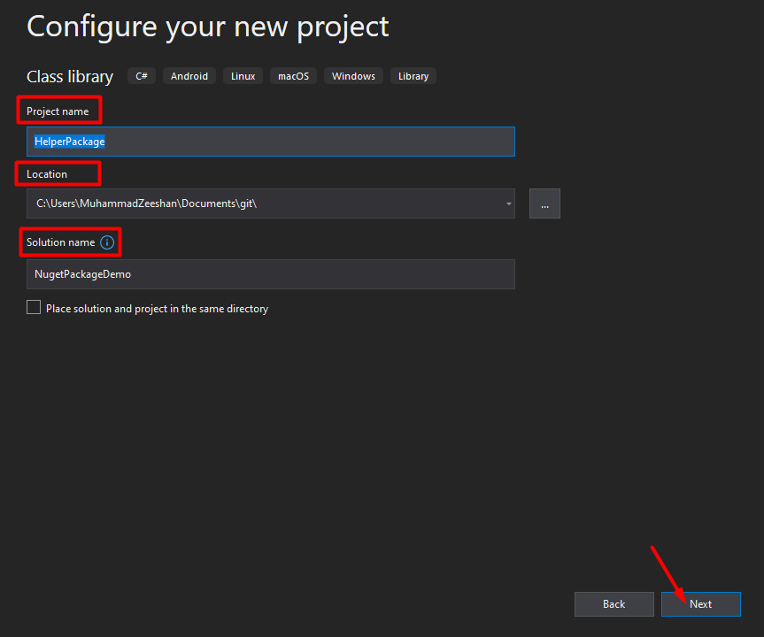

## Create-DotNet-Standard-Library
This repository contains information about creating .Net standard library to publish as NuGet package.

# How to create .Net Standard Library

1. Launch new instance of __Visual Studio__ > Click __Create a New Project__

2. Search for Class Library to select **.NET Standard Library**.

3. Fill in the required fields > Set **Name** to **HelperPackage** > **Solution** Name to **NuGetPackageDemo** and Click **Next**

