## Create-DotNet-Standard-Library
This repository contains information about creating .Net standard library to publish as NuGet package.

# How to create .Net Standard Library

1. Launch new instance of __Visual Studio__ > Click __Create a New Project__
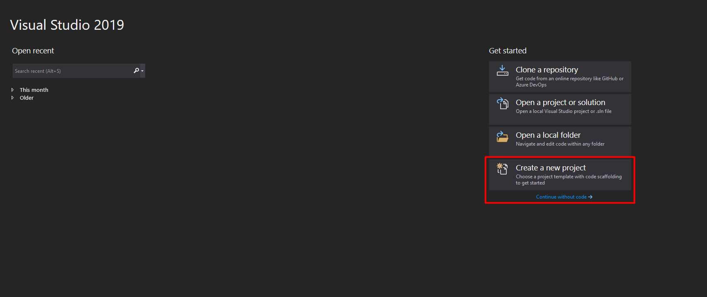

2. Search for Class Library to select **.NET Standard Library**.
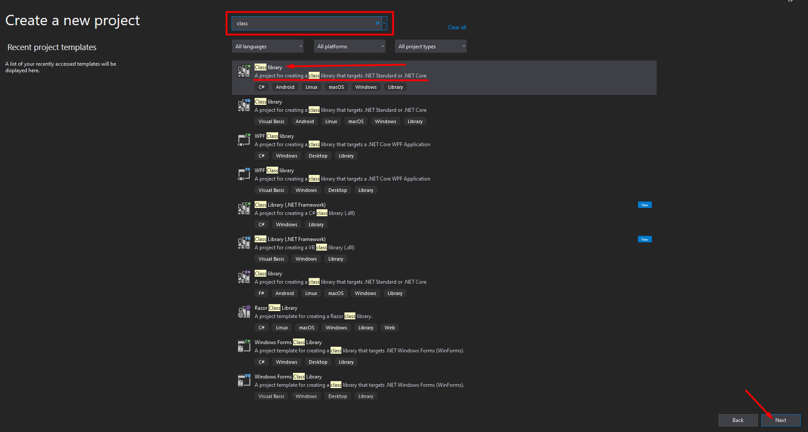

3. Fill in the required fields > Set **Name** to **HelperLibrary** > **Solution** Name to **NuGetDemo** and Click **Next**
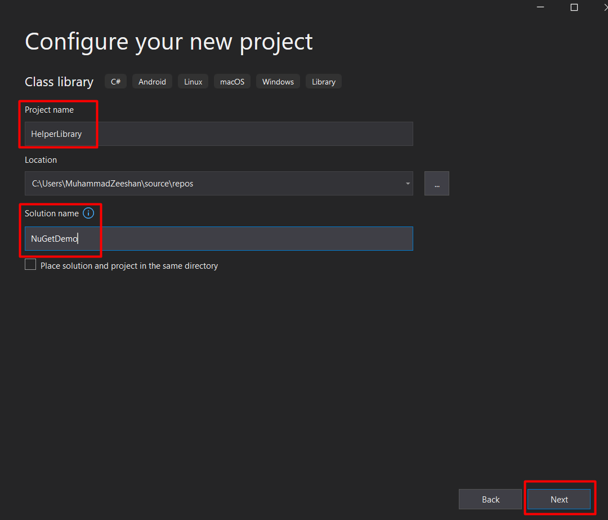

4. Select **.NET Core 3.1** as Target Framework and Click **Create**
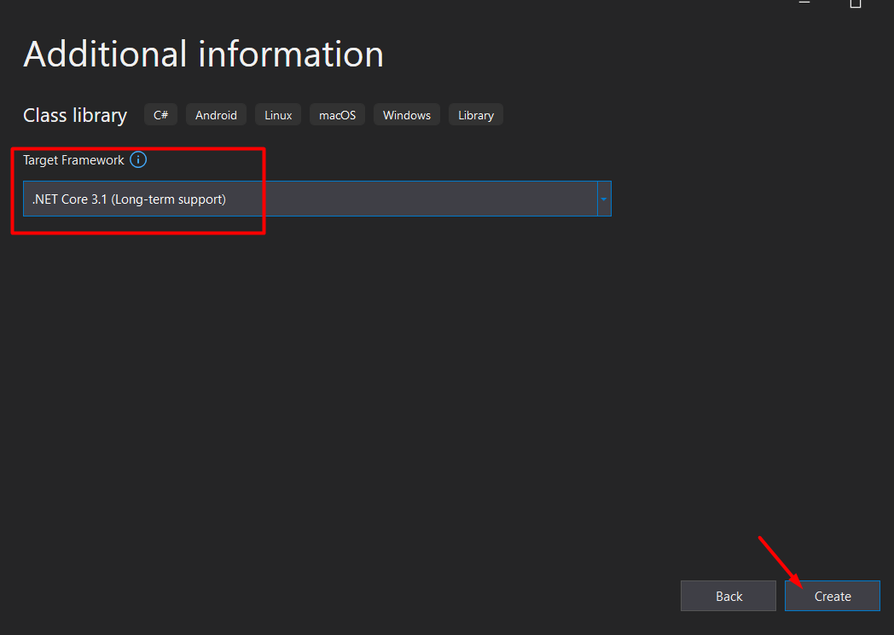

5. Once we click on **Create**, we are going to delete the Class1 that creates by default. **Right Click** (or press Del) to delete the class.
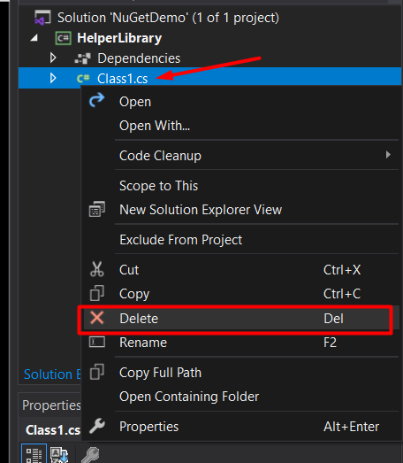

Now we will set the namespace for our project. You can leave the default value as it is but I'm going to change it to "**ACloudTechie.Artifact**" so it looks little bit different. It means, every class from now on will get the "**ACloudTechie.Artifact**" as a namespace.

1. Now, Right Click on Project (**HelperLibrary**) file and Select **Properties**.
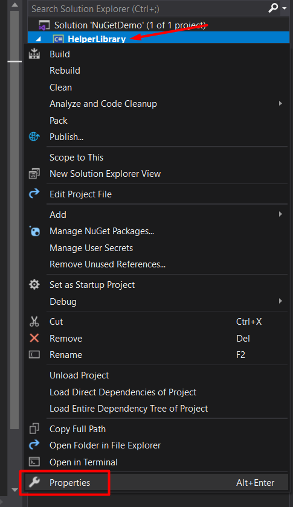

7. Set Default namespace as **ACloudTechie.Artifact** and Click **Save**.
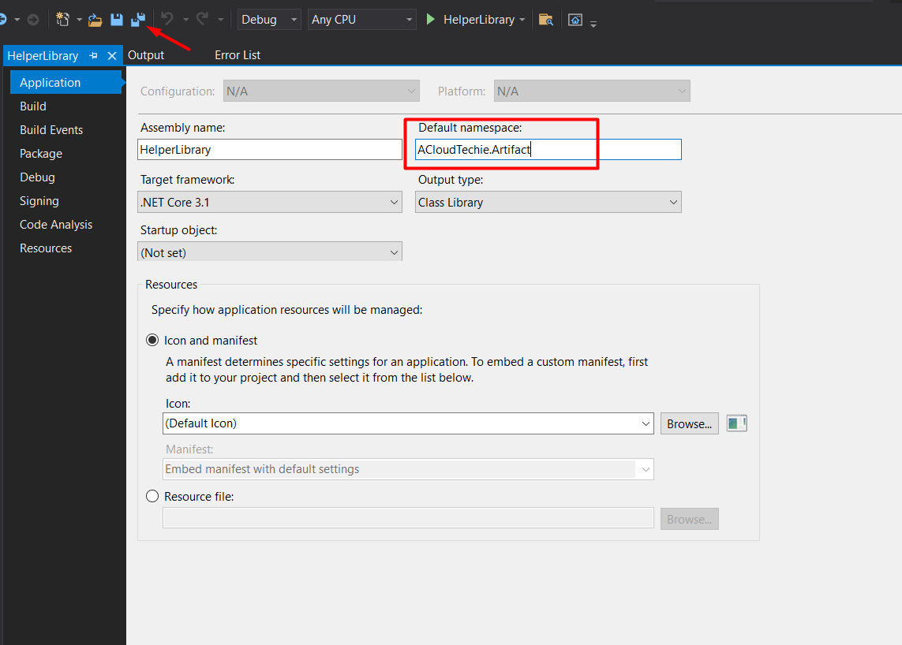

8. Right Click on Project node and add new **Folder**. Set the name to **Calculate**
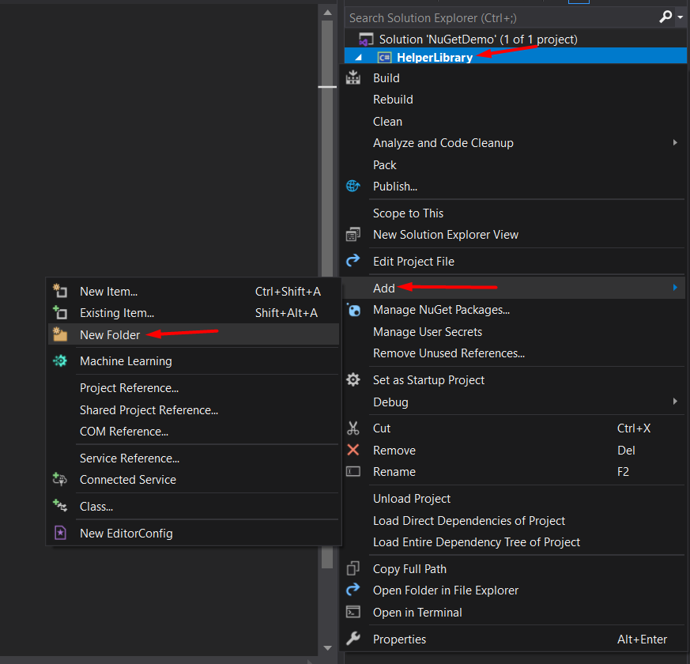
   
9. Add new **Class** as this will be very standard class library to demo something.
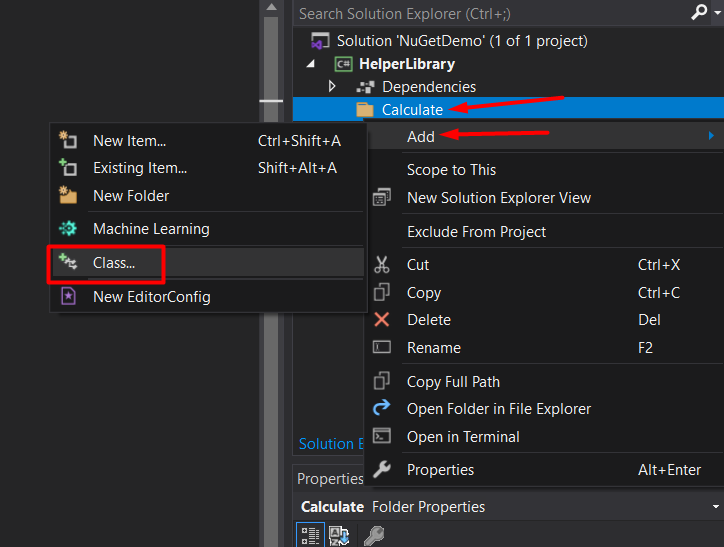

10. Set Class name to **Calculate** and click on **Add**
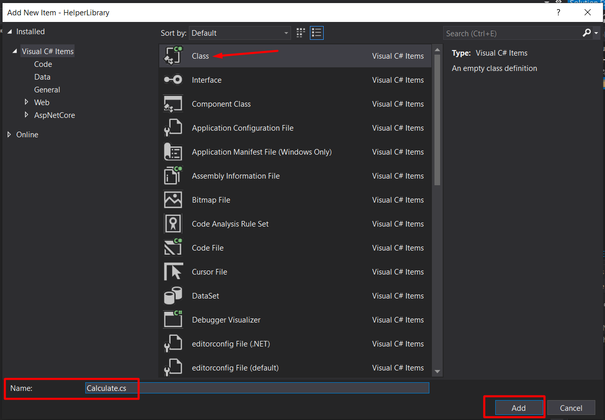

---
### Let's Start some coding 👨‍💻

This class will contain two super helpful methods. One method *adds two number* together and other *subtracts* one number from the other.

### Code Snippet

```dotnet
using System;
using System.Collections.Generic;
using System.Text;

namespace ACloudTechie.Artifact.Calculate
{
    public class Calculator
    {
        public static double Add(double numOne, double numTwo)
        {
            return numOne + numTwo;
        }

        public static double Subtract(double numOne, double numTwo)
        {
            return numOne - numTwo;
        }
    }
}
```

11. Now, foundation of our library has been setup.
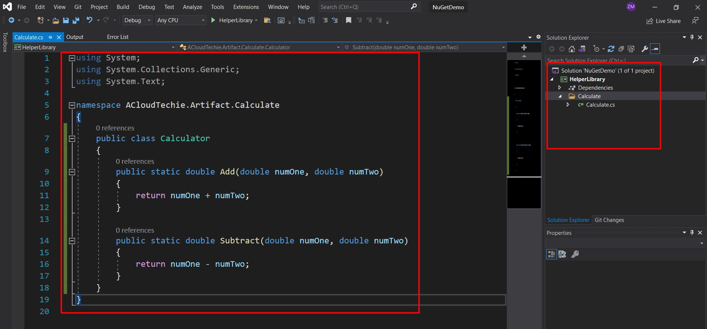

---

## Conclusion
In this post, we went through step-by-step to see how we can create a .Net Standard Library that can be used as a NuGet Package and publish to feed in [Azure Artifacts](https://acloudtechie.com/how-to-use-azure-pipelines-and-artifacts-for-package-management).

## Thank You
Thank you for reading!

Follow me for more content at https://acloudtechie.com
Let's Grow together! [](https://twitter.com/zeeshanmcp12)
